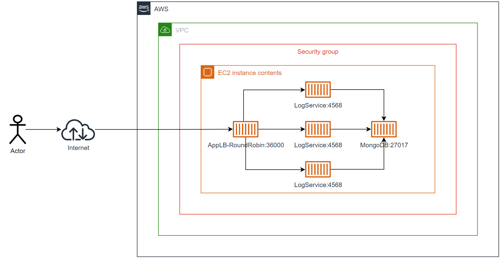
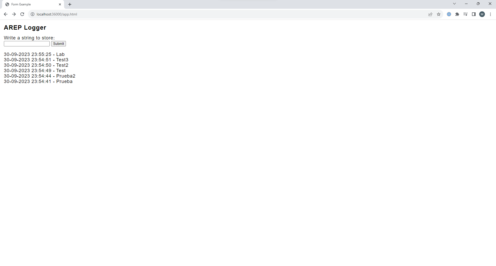

# Architectural Patterns

The application is a website where the user can enter messages in a form and send them. Upon sending, the web page displays a list of the last 10 messages sent along with the date they were sent.

### Architecture

##### AppLB-RoundRobin
The web application APP-LB-RoundRobin consists of a web client and a REST service. The web client has a field and a button, and whenever the user sends a message, it sends it to the REST service and updates the screen with the information returned in JSON format. The REST service receives the string and implements a Round Robin load balancing algorithm, delegating the processing of the message and the return of the response to each of the three instances of the LogService service.

##### Log Service
LogService is a REST service that receives a string, stores it in the database, and responds with a JSON object containing the last 10 strings stored in the database along with the date they were stored.

##### MongoDB 
The MongoDB service is an instance of a MongoDB database, it stores the messages sent by the log service and the date they were stored.

### Image of the architecture



### Prerequisites

To run the software you will need to have these installed in your machine:

* [Java](https://www.java.com/)
* [Maven](https://maven.apache.org/)
* [Docker](https://www.docker.com/)


### Installing

In order to install de program, follow the next steps:

Clone both the repositories that make up the application:

Log Service

```
git clone https://github.com/miguelsalamanca007/ArepLogService.git
```
AppLB RoundRobin
```
git clone https://github.com/miguelsalamanca007/ArepLogWebApp.git
``` 
Locate yourself in the directory where you cloned one of the projects in and run
```
mvn clean install
```
Repeat the same step for the other project

#### Building the Docker images

to build the docker images, run the following command (you have to be located in the project directory)
Log Service
```
docker build --tag logger-service . -f dockerfileservice
```
Now locate yourself in the AppLB RoundRobin directory and run
```
docker build --tag logger-webapp . -f dockerfilewebapp
```
#### Running the project

To run the project, execute the following commands:
```
docker network create my_network
```
```
docker run -d -p 36001:4568 --name logger-service1 --network my_network logger-service
```
```
docker run -d -p 36002:4568 --name logger-service2 --network my_network logger-service
```
```
docker run -d -p 36003:4568 --name logger-service3 --network my_network logger-service
```
```
docker run -d -p 36000:4567 --name logger-webapp --network my_network logger-webapp
```
```
docker run -d -p 27017:27017 -v mongodb:/data/db -v mongodb_config:/data/configdb --name db --network my_network mongo:3.6.1 mongod
```
After that, you should be able to enter the webpage in the following url
```
http://localhost:36000/app.html
```
Image of what you will see

### Video of the application deployed
[This is a video of the application running on AWS](linl)
## Built With

* [Java](https://www.java.com/) - The programming language used
* [HTML](https://html.com/document/) - The markup language used for the home's page structure
* [JavaScript](https://www.javascript.com/) - The programming language used for the front's page logic
* [CSS](https://developer.mozilla.org/es/docs/Web/CSS) - The style language used
* [Maven](https://maven.apache.org/) - Dependency Management
* [Docker](https://www.docker.com/) - Container Management

## Versioning

I use [Git](https://git-scm.com/) for versioning.

## Authors

* **Miguel Angel Salamanca**  - [GitHub](https://github.com/miguelsalamanca007) - [LinkedIn](https://www.linkedin.com/in/miguel-%C3%A1ngel-salamanca-alarc%C3%B3n-714956265/)